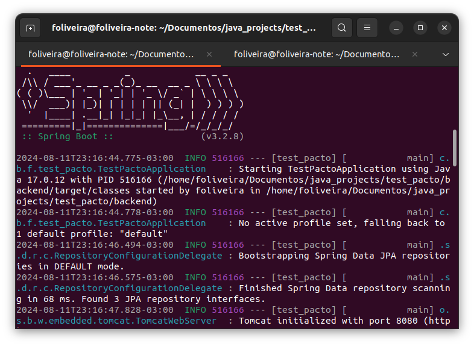
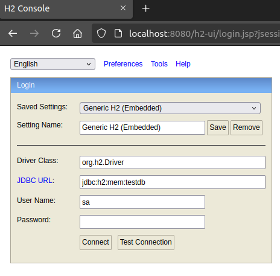
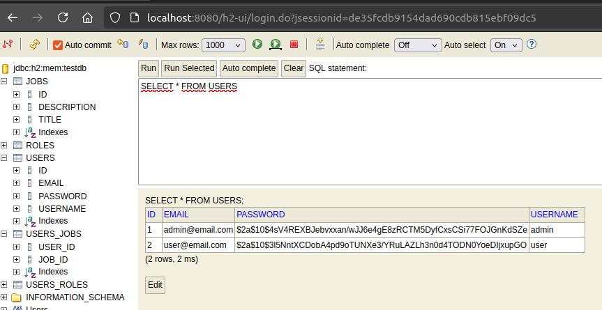
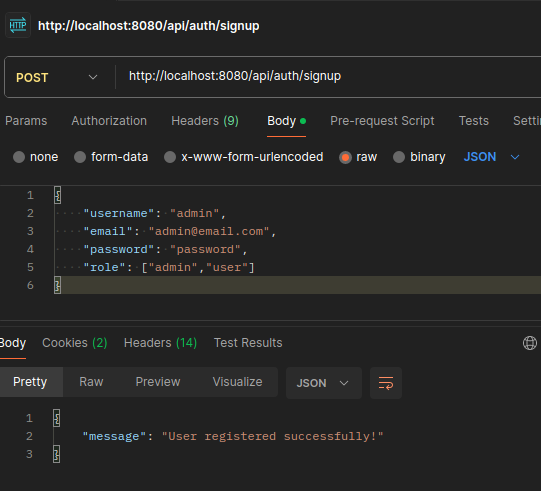
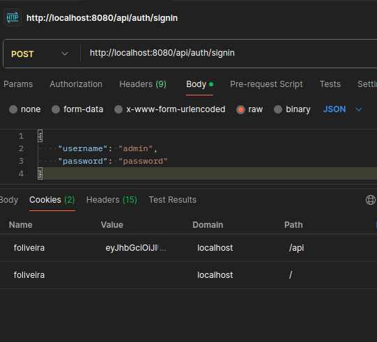
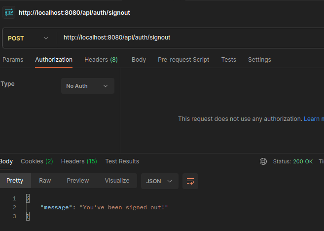
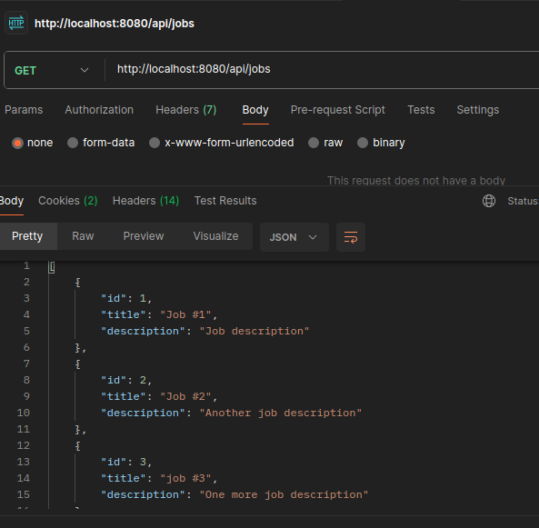
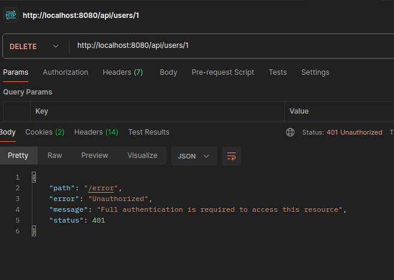

# aplicação web para o processo de recrutamento interno
Este projeto é parte de um Desafio Técnico para Desenvolvedor Full Stack. Esta parte é referente ao backend da aplicação. sendo necessária para sua correta execução configurar e executar o frontend, podendo ser encontrado [neste repositório](https://github.com/FelipOliveira/test_pacto_frontend)

Para executar esta aplicação serão necessários:

- Java 17
- Spring Boot 3
- Maven 3.6.3
	
Para manter a simplicidade do  projeto, será utilizado um banco de dados em memória `H2`. A autenticação é feito por meio HttpOnly Cookie.

## Configurando e executando
Abra o terminal no mesmo diretório da aplicação e digite o comando `mvn spring-boot:run`.

O banco de dados será inicializado e todas as dependências necessárias serão instaladas, após essa etapa a aplicação estará disponível a partir de `localhost:8080`.

Para abrir a interface do banco de dados use a url `localhost:8080/h2-ui`.

Não serão necessárias configurações adicionais, basta clicar no botão `connect` para ter acesso aos schemas.

## Testando a aplicação com o Postman

A partir do Postman podem ser acessadas as urls para testar a aplicação. Os endpoints são os seguintes:

- `POST /api/auth/signup` cadastra um novo usuário;

- `POST /api/auth/signin` usa as credenciais cadastradas para entrar na aplicação;

- `POST /api/auth/signout` sai da aplicação

- `GET /api/users/{id}` retorna um usuário através de seu id;
- `GET /api/users/{userId}/avalaiblejobs` retorna uma lista de vagas disponíveis para o usuário;
- `GET /api/users/{userId}/myjobs` retorna a lista com as vagas que o usuário se candidatou;
- `POST /api/users/{userId}/{jobId}` adiciona uma vaga ao usuário;
- `PUT /api/users/{id}` edita um usuário através de seu id;
- `DELETE /api/users/{userId}/{jobId}` remove uma vaga de um usuário;
- `DELETE /api/users/{userId}` deleta um usuário;

- `GET /api/jobs` retorna uma lista com todas as vagas;

- `GET /api/jobs/{id}` retorna uma vaga através de seu id;
- `POST /api/jobs` cria uma nova vaga;
- `PUT /api/jobs/{id}` edita uma vaga através de seu id;
- `DELETE /api/jobs/{id}` deleta uma vaga;

Caso um usuário sem as credenciais corretas tenta acessar um endpoint protegido, o aplicação retorna o erro.

## Testes unitários
As classes de testes foram incluídas em `src/test/java/com/br/foliveira/backend_spring`.
